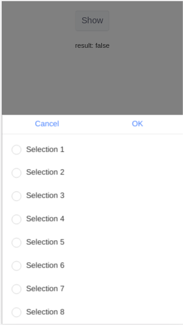

# @senntyou/mint-ui

[English Documentation](./README.en.md)

[mint-ui](https://github.com/ElemeFE/mint-ui) 扩展.

官方 `mint-ui` 仓库缺失很多功能, 并且目前没有人维护了, 所以我在这里添加了一些组件.

```
npm install @senntyou/mint-ui --save
```

```
import {
  Picker,
} from '@senntyou/mint-ui';
```

## Picker: 弹出选择器


```
import Vue from 'vue';
import { Popup, Picker, DatetimePicker } from 'mint-ui';
import { Picker as StPicker } from '@senntyou/mint-ui';
import '@senntyou/mint-ui/es/styles.css';

// 这些需要首先加载
Vue.component(Popup.name, Popup);
Vue.component(Picker.name, Picker);
Vue.component(DatetimePicker.name, DatetimePicker);
// 然后是这里
Vue.component(StPicker.name, StPicker);
```

```
<template>
  <st-mt-picker
    v-model="showPicker"
    :items="items"
    :onSubmit="onSubmit"
  />
</template>

<script>
export default {
  data() {
    return {
      showPicker: !1,
      items: [ ... ],
    };
  },
  methods: {
    onSubmit(values) {},
  },
};
</script>
```

- `model`: `bool` `required` 是否显示 picker
- `items`: `array` `required` 供选择的 items
- `onSubmit`: `function` `required` 确定的回调, `values => { ... }`
- `onCancel`: `function` 取消的回调, `() => { ... }`
- `okText`: `string` `default: OK` 确定按钮文本
- `cancelText`: `string` `default: Cancel` 取消按钮文本
- `divider`: `bool` `default: false` 是否显示分隔符
- `visibleItemsCount`: `number` `default: 5` 可见项目数

#### items

一级:

```
[{ value: '1' }, { value: '2' }, { value: '3' }]
```

二级:

```
[
  {
    value: '1',
    children: [{ value: '1-1' }, { value: '1-2' }, { value: '1-3' }],
  },
  {
    value: '2',
    children: [{ value: '2-1' }, { value: '2-2' }, { value: '2-3' }],
  },
]
```

三级:

```
[
  {
    value: '1',
    children: [
      {
        value: '1-1',
        children: [{ value: '1-1-1' }, { value: '1-1-2' }, { value: '1-1-3' }],
      },
      {
        value: '1-2',
        children: [{ value: '1-2-1' }, { value: '1-2-2' }, { value: '1-2-3' }],
      },
    ],
  },
  {
    value: '2',
    children: [
      {
        value: '2-1',
        children: [{ value: '2-1-1' }, { value: '2-1-2' }, { value: '2-1-3' }],
      },
      {
        value: '2-2',
        children: [{ value: '2-2-1' }, { value: '2-2-2' }, { value: '2-2-3' }],
      },
    ],
  },
]
```

#### onSubmit

```
values => { ... }
```

- 一级: `values: ['1']`
- 二级: `values: ['1', '1-1']`
- 三级: `values: ['1', '1-1', '1-1-1']`

#### 示例

[view/picker/App.vue](./view/picker/App.vue)

## MultiSelect: 弹出多选选择器



```
import Vue from 'vue';
import { Popup, DatetimePicker, Checklist } from 'mint-ui';
import { MultiSelect as StMultiSelect } from '@senntyou/mint-ui';
import '@senntyou/mint-ui/es/styles.css';

// 这些需要首先加载
Vue.component(Popup.name, Popup);
Vue.component(DatetimePicker.name, DatetimePicker);
Vue.component(Checklist.name, Checklist);
// 然后是这里
Vue.component(StMultiSelect.name, StMultiSelect);
```

```
<template>
  <st-mt-multi-select
    v-model="showPicker"
    :options="options"
    :onSubmit="onSubmit"
  />
</template>

<script>
export default {
  data() {
    return {
      showPicker: !1,
      options: ['Selection 1', 'Selection 2', ...],
    };
  },
  methods: {
    onSubmit(values) {},
  },
};
</script>
```

- `model`: `bool` `required` 是否显示 picker
- `options`: `array` `required` 供选择的 options
- `onSubmit`: `function` `required` 确定的回调, `values => { ... }`
- `onCancel`: `function` 取消的回调, `() => { ... }`
- `okText`: `string` `default: OK` 确定按钮文本
- `cancelText`: `string` `default: Cancel` 取消按钮文本

#### onSubmit

```
values => { ... }
```

```
values: ['Selection 1', 'Selection 2', ...]
```

#### 示例

[view/multi-select/App.vue](./view/multi-select/App.vue)
